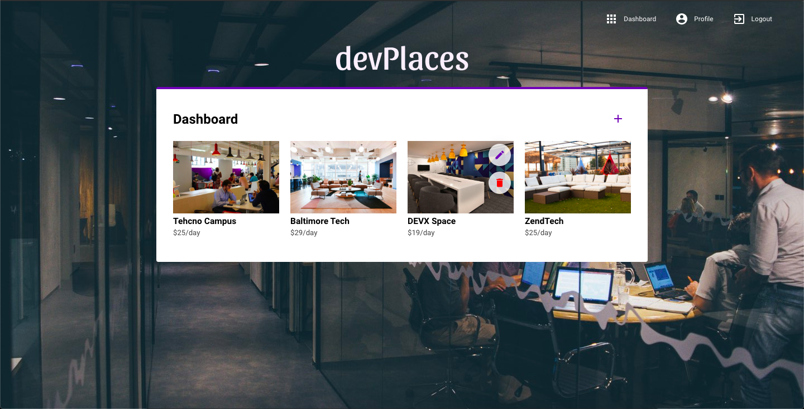

[](https://opensource.org/licenses/MIT)
[](https://standardjs.com)

# devplaces-web

Web application for the project devPlaces which is inspired in Rocketseat Omnistack Week 9





## Installation

Clone the project

```bash
git clone https://github.com/rafaelcalhau/devplaces-web.git devplaces
```

Navigate into the project folder

```bash
cd devplaces
```

Install all dependencies using the NPM or YARN

```bash
npm install # or yarn
```

## Settings

There is a settings file and you can utilize in order to configure the App's name, API server address and more.
First, copy it to "settings.json" and edit it with your own data.

> src/config/settings.json

```bash
cp ./src/config/settings.example.json ./src/config/settings.json
```

## Usage

Development start:

```bash
npm run start # or yarn start
```

To build it:

```bash
npm run build # or yarn build
```

After to build it, check the build directory, all compiled files will be there.
Now, just publish it on your local or remote server :)

## License

[MIT](https://choosealicense.com/licenses/mit/)
